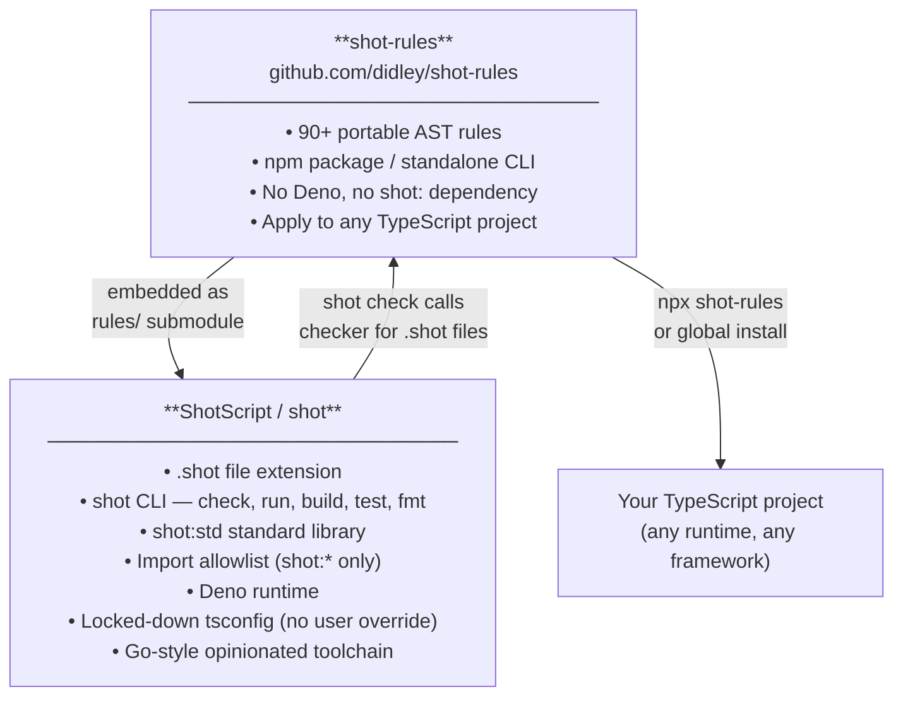

```
 ███████╗██╗  ██╗ ██████╗ ████████╗
 ██╔════╝██║  ██║██╔═══██╗╚══██╔══╝
 ███████╗███████║██║   ██║   ██║   
 ╚════██║██╔══██║██║   ██║   ██║   
 ███████║██║  ██║╚██████╔╝   ██║   
 ╚══════╝╚═╝  ╚═╝ ╚═════╝    ╚═╝   
 ShotScript — Go-style TypeScript. One way to do everything.
```

TypeScript has four ways to write a function, three ways to handle errors, two ways to declare a type — and most codebases use all of them. shot removes the extras and keeps one of each.

No arrow functions. No `throw`. No `class`. No `interface`. No `any`. No ternary. No optional properties. The rules aren't configurable — that's the point. Consistency you don't have to think about.

- **File extension / CLI:** `.shot` + `shot` command
- **Runtime:** Deno (type-checks before running, like `go run`)
- **LLM-friendly:** one form per construct — models generate consistent, statically-checkable code without needing to read implementation details

## Quick taste

```ts
// foo.shot
import { fetch, jsonParse } from "shot:std"

type User = { id: number; name: string }

async function getUser(id: number): Promise<[User | null, Error | null]> {
    const [res, fetchErr] = await fetch(`https://api.example.com/users/${id}`)
    if (fetchErr !== null) {
        return [null, fetchErr]
    }
    const text = await res.text()
    return jsonParse<User>(text)
}
```

No arrow functions. No `throw`. No `interface`. No `class`. No `any`. No `as`. No ternaries. No third-party imports outside the `shot:` and `jsr:@shotscript/*` namespaces (relative `.shot` imports allowed). The list of what's banned is the language.

## What the simplifications look like

**Error handling — tuples instead of exceptions**

```ts
// TypeScript
async function getUser(id: number): Promise<User> {
    try {
        const res = await fetch(`/users/${id}`)
        if (!res.ok) throw new Error(`HTTP ${res.status}`)
        return res.json() as User
    } catch (e) {
        throw new Error(`getUser failed: ${e}`)
    }
}

// ShotScript — no throw, no try, no hidden control flow
async function getUser(id: number): Promise<[User | null, Error | null]> {
    const [res, fetchErr] = await fetch(`/users/${id}`)
    if (fetchErr !== null) {
        return [null, fetchErr]
    }
    return jsonParse<User>(await res.text())
}
```

**No ternaries — if/else forces names on branches**

```ts
// TypeScript
const label = isAdmin ? (isSuperAdmin ? "Super Admin" : "Admin") : "User"

// ShotScript — nesting is gone, each case is readable
function roleLabel(isAdmin: boolean, isSuperAdmin: boolean): string {
    if (isSuperAdmin) {
        return "Super Admin"
    }
    if (isAdmin) {
        return "Admin"
    }
    return "User"
}
```

**`null` is the only absent value**

```ts
// TypeScript — three ways to say "nothing": undefined, ?, | undefined
type User = { id: number; avatar?: string; deletedAt?: Date }
function getUser(id?: number): User | undefined { ... }

// ShotScript — undefined never appears; every absence is explicit and typed
type User = { readonly id: number; readonly avatar: string | null; readonly deletedAt: Date | null }
function getUser(id: number): [User | null, Error | null] { ... }
```

**No classes — plain data types and functions**

```ts
// TypeScript
class UserService {
    private readonly db: Database
    constructor(db: Database) { this.db = db }
    async findById(id: number): Promise<User | null> { ... }
}

// ShotScript — a type and a function, nothing hidden
type UserService = { readonly db: Database }

async function findUserById(svc: UserService, id: number): Promise<[User | null, Error | null]> {
    return svc.db.query<User>(`SELECT * FROM users WHERE id = $1`, [id])
}
```

## Install

```
curl -fsSL https://shot.didley.dev/install.sh | sh
```

Verify:
```
shot --version
```

The installer is a small script that handles everything needed to run shot on your machine. Read it first if you prefer — it's published alongside every release.

Windows installer and prebuilt binaries are on the roadmap.

## CLI

```
shot init <name>         Scaffold a new project directory.
shot check [files...]    Validate .shot files.
shot fmt [files...]      Format in-place via deno fmt.
shot build [files...]    Validate → type-check.
shot run <file>          Validate → type-check → run via Deno.
shot test [files...]     Validate → type-check → run *.test.shot files.
```

## Ecosystem



ShotScript is the full opinionated language — `.shot` files, `shot:std`, Deno runtime, locked config, all-or-nothing. `shot-rules` is the rule engine extracted so you can apply the same discipline to an existing TypeScript project without committing to the Shot ecosystem. Changes to rules flow from `shot-rules` into ShotScript automatically via the submodule.

## Documentation

- [`docs/PHILOSOPHY.md`](docs/PHILOSOPHY.md) — what shot is and isn't
- [`docs/LANGUAGE.md`](docs/LANGUAGE.md) — full rule list with examples
- [`docs/ARCHITECTURE.md`](docs/ARCHITECTURE.md) — how the toolchain works
- [`docs/STDLIB.md`](docs/STDLIB.md) — the `shot:std` v1 surface
- [`docs/CLI.md`](docs/CLI.md) — command reference

## Status

v1 complete.
