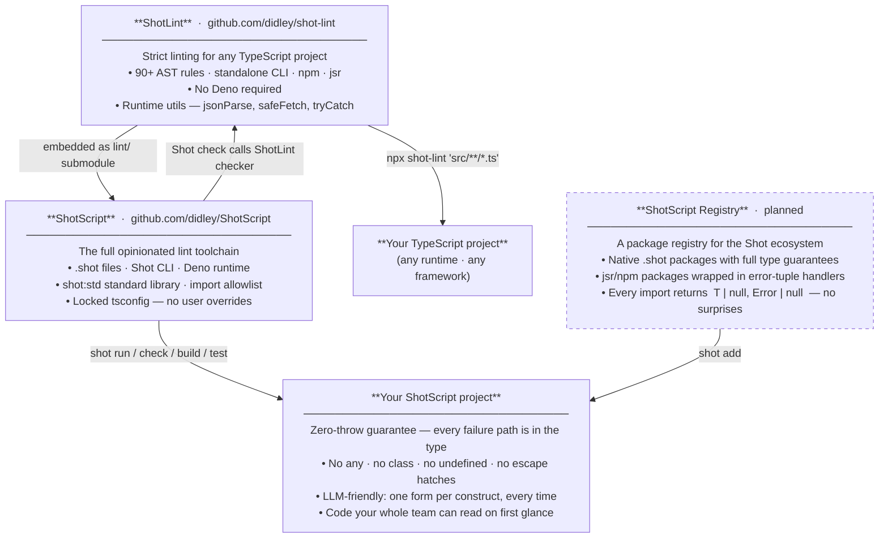

```
 ███████╗██╗  ██╗ ██████╗ ████████╗
 ██╔════╝██║  ██║██╔═══██╗╚══██╔══╝
 ███████╗███████║██║   ██║   ██║   
 ╚════██║██╔══██║██║   ██║   ██║   
 ███████║██║  ██║╚██████╔╝   ██║   
 ╚══════╝╚═╝  ╚═╝ ╚═════╝    ╚═╝   
 TypeScript, one way.

 Shot extracts features from TypeScript, applying Go's "one canonical way" philosophy to the TS/JS ecosystem.
 Making coding easier for humans and LLMs.
```

Echosystem:
**[ShotScript](https://github.com/didley/ShotScript)** — Opinionated toolchain strictly enforcing Shots principles.
**[ShotLint](https://github.com/didley/ShotLint)** — Utils and config for typing, linting, and formatting with Shots principles.

## Quick taste

```ts
// foo.shot
import { fetch, jsonParse } from "shot:std"

type User = { id: number; name: string }

async function getUser(id: number): Promise<[User | null, Error | null]> {
    const [res, fetchErr] = await fetch(`https://api.example.com/users/${id}`)
    if (fetchErr !== null) {
        return [null, fetchErr]
    }
    const text = await res.text()
    return jsonParse<User>(text)
}
```

No arrow functions. No `throw`. No `interface`. No `class`. No `any`. No `as`. No ternaries. No third-party imports outside the `shot:` and `jsr:@shotscript/*` namespaces (relative `.shot` imports allowed). The list of what's banned is the language.

## Install

```
curl -fsSL https://shot.didley.dev/install.sh | sh
```

Verify:
```
shot --version
```

The installer is a small script that handles everything needed to run Shot on your machine. Read it first if you prefer — it's published alongside every release.

Windows installer and prebuilt binaries are on the roadmap.

## CLI

```
shot init <name>         Scaffold a new project directory.
shot check [files...]    Validate .shot files.
shot fmt [files...]      Format in-place via deno fmt.
shot build [files...]    Validate → type-check.
shot run <file>          Validate → type-check → run via Deno.
shot test [files...]     Validate → type-check → run *.test.shot files.
```

## What the simplifications look like

**Error handling — tuples instead of exceptions**

```ts
// TypeScript
async function getUser(id: number): Promise<User> {
    try {
        const res = await fetch(`/users/${id}`)
        if (!res.ok) throw new Error(`HTTP ${res.status}`)
        return res.json() as User
    } catch (e) {
        throw new Error(`getUser failed: ${e}`)
    }
}

// ShotScript — failure is in the return type; the compiler tracks it
async function getUser(id: number): Promise<[User | null, Error | null]> {
    const [res, fetchErr] = await fetch(`/users/${id}`)
    if (fetchErr !== null) {
        return [null, fetchErr]
    }
    return jsonParse<User>(await res.text())
}
```

**`null` only — no `undefined`**

```ts
// TypeScript — three ways to say "nothing": undefined, ?, | undefined
type User = { id: number; avatar?: string; deletedAt?: Date }
function getUser(id?: number): User | undefined { ... }

// ShotScript — one absence value, used consistently everywhere
type User = { readonly id: number; readonly avatar: string | null; readonly deletedAt: Date | null }
function getUser(id: number): [User | null, Error | null] { ... }
```

**No complex types — compose, don't extend**

```ts
// TypeScript — intersection to "extend" a base type
type User = { readonly id: number; readonly name: string }
type AdminUser = User & { readonly role: 'admin' }

// ShotScript — embed as a named field
type User = { readonly id: number; readonly name: string }
type AdminUser = { readonly user: User; readonly role: 'admin' }

// access: admin.user.id  not  admin.id
```

**Immutable by default**

```ts
// TypeScript — any function can mutate these; nothing in the type stops it
type Config = { host: string; port: number }
const ids: number[] = []

// ShotScript — readonly at the type level; the compiler enforces it
type Config = { readonly host: string; readonly port: number }
const ids: ReadonlyArray<number> = []
```

**No classes — plain data and functions**

```ts
// TypeScript
class UserService {
    private readonly db: Database
    constructor(db: Database) { this.db = db }
    async findById(id: number): Promise<User | null> { ... }
}

// ShotScript — a type and a function, nothing hidden
type UserService = { readonly db: Database }

async function findUserById(svc: UserService, id: number): Promise<[User | null, Error | null]> {
    return svc.db.query<User>(`SELECT * FROM users WHERE id = $1`, [id])
}
```

**Named functions only — every callback is findable**

```ts
// TypeScript
const results = items
    .filter(x => x.active)
    .map(x => ({ ...x, score: x.score * 2 }))
    .reduce((acc, x) => acc + x.score, 0)

// ShotScript — every step is named, testable, and grep-able
function isActive(item: Item): boolean { return item.active }
function doubleScore(item: Item): Item { return { ...item, score: item.score * 2 } }
function sumScore(acc: number, item: Item): number { return acc + item.score }

const results = items.filter(isActive).map(doubleScore).reduce(sumScore, 0)
```

**No ternaries — if/else forces names on branches**

```ts
// TypeScript
const label = isAdmin ? (isSuperAdmin ? "Super Admin" : "Admin") : "User"

// ShotScript — nesting is gone, each case is readable
function roleLabel(isAdmin: boolean, isSuperAdmin: boolean): string {
    if (isSuperAdmin) { return "Super Admin" }
    if (isAdmin) { return "Admin" }
    return "User"
}
```

## Ecosystem



ShotScript is the full opinionated language — `.shot` files, `shot:std`, Deno runtime, locked config, all-or-nothing. `shot-lint` is the rule engine extracted so you can apply the same lint to an existing TypeScript project without committing to the Shot ecosystem. Changes to rules flow from `shot-lint` into ShotScript automatically via the submodule.

## Documentation

- [`docs/PHILOSOPHY.md`](docs/PHILOSOPHY.md) — what Shot is and isn't
- [`docs/LANGUAGE.md`](docs/LANGUAGE.md) — full rule list with examples
- [`docs/ARCHITECTURE.md`](docs/ARCHITECTURE.md) — how the toolchain works
- [`docs/STDLIB.md`](docs/STDLIB.md) — the `shot:std` v1 surface
- [`docs/CLI.md`](docs/CLI.md) — command reference
